

  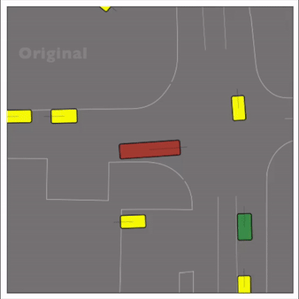

<!--  -->

How can we evaluate our trucks’ autonomous software? Autonomous vehicle stacks (AVs) in simulation typically involves replaying driving logs from real-world recorded traffic. However, agents replayed from offline data are not reactive and are difficult to intuitively control. Existing approaches address these challenges by relying on heuristics or generative models of real-world data, but these methods either lack realism or require costly iterative sampling procedures to control the generated behaviors. 

We propose CtRL-Sim, a framework that leverages return-conditioned offline reinforcement learning (RL) to enable reactive, closed-loop, and controllable behavior simulation within a physics-enhanced Nocturne environment. Our approach features a return-conditioned multi-agent encoder-decoder Transformer architecture that imitates driving behaviors from a curated offline RL Waymo dataset. Furthermore, we introduce exponential tilting of the predicted return distribution as an efficient and straightforward mechanism for controlling simulated agent behaviors. CtRL-Sim enables the generation of a diverse range of realistic driving behaviors, extending beyond the initial dataset, including adversarial behaviors crucial for safety-critical scenario generation. 

## Key Features 

- Reactive Simulation: Unlike traditional replay methods, CtRL-Sim supports closed-loop simulations with responsive agent behaviors. 

- Controllability: The framework allows precise control of agent behaviors, facilitating the creation of both typical and adversarial driving scenarios. 

- Offline Reinforcement Learning: By leveraging return-conditioned offline RL, CtRL-Sim generates a wide range of behaviors without requiring real-time interaction with the environment. 

- Transformer Architecture: The multi-agent encoder-decoder Transformer model enables sophisticated behavior prediction and generation, ensuring high-fidelity simulation. 

- Safety-Critical Scenarios: CtRL-Sim is designed to generate safety-critical scenarios, providing a valuable tool for testing and improving autonomous vehicle systems. 

## Applications 

- Safety-critical scenario generation 

- Training and evaluation of autonomous driving algorithms

 - Enhancing Data augmentation

## Architecture

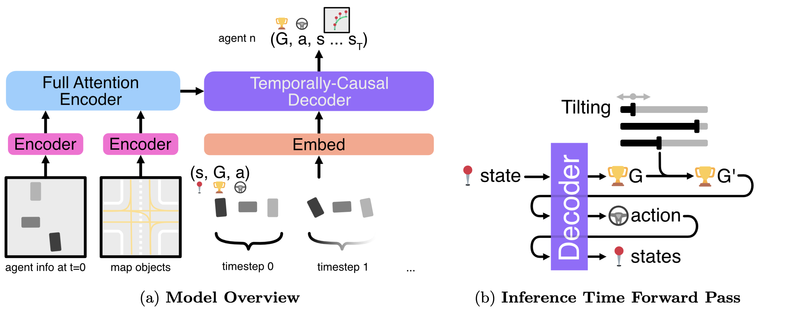

We propose to learn a multi-agent return-conditioned policy, parameterized using a novel autoregressive encoder-decoder Transformer architecture, which can be scalably trained via next-token prediction. 

At inference time, we leverage exponential tilting to control the agent behaviours. Negative tilting values yield bad driving behaviours while positive tilting values yields good driving behaviours. This provides an interpretable and efficient mechanism for controlling agent behaviours, and circumvents the need for expensive iterative sampling processes such as Bayesian optimization or guided diffusion sampling.

## Examples

<!--  -->
CtRL-Sim can faithfully imitate the multi-agent driving behaviours found in the Waymo dataset. The green and red agents are controlled by CtRL-Sim, and other agents in yellow are set to log-replay. We can see that all agents can drive on the road in a realistic manner.

| 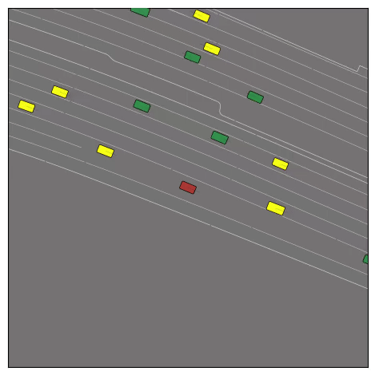 | 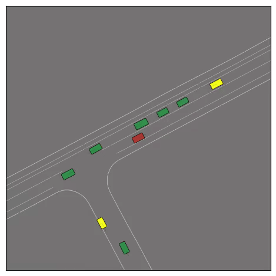 | 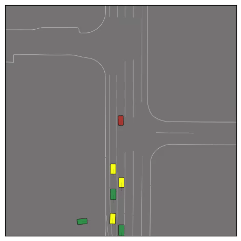 |
|---------------------|---------------------|---------------------|
| 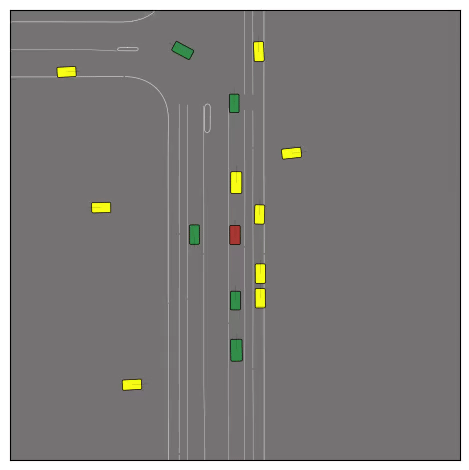 | 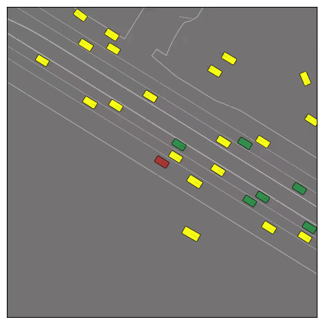 | 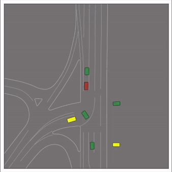 |

<!--  -->

Exponential tilting enables control over the generation of realistic vehicle-vehicle collision scenarios. We show the evolution of three traffic scenes with the top panels showing the base CtRL-Sim model controlling one interacting agent (green) with a planner (red). The bottom panels applying negative tilting to the CtRL-Sim- controlled agent (green). All other agents are set to log-replay through physics. 

| Original | 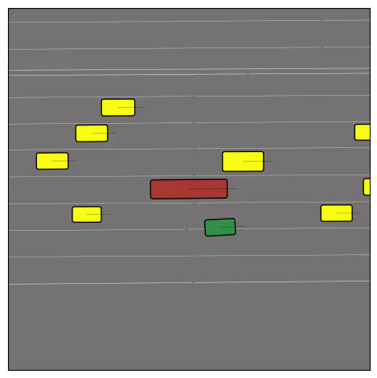 | 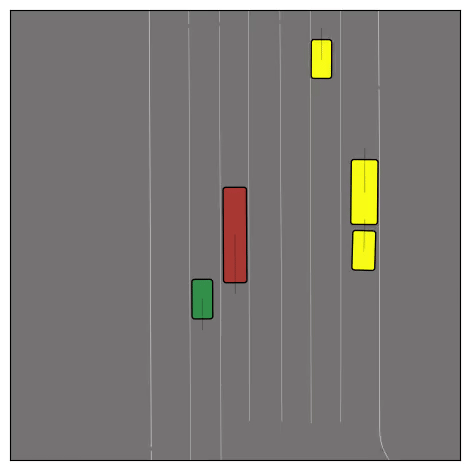 | 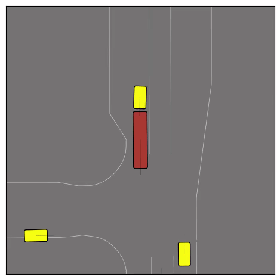 |
|---------------------|---------------------|---------------------|---------------------|
| Adversarial | 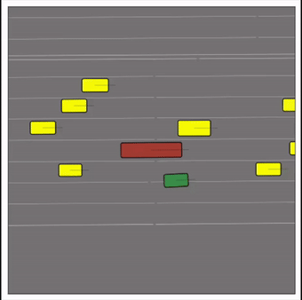 |  | 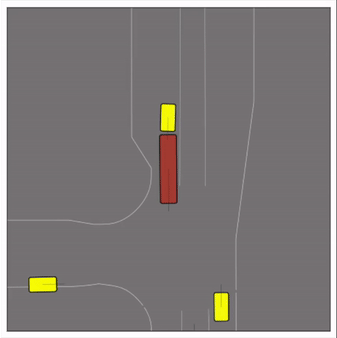 |

## Bibtex

    @inproceedings{
      rowe2024ctrlsim,
      title={Ct{RL}-Sim: Reactive and Controllable Driving Agents with Offline Reinforcement Learning},
      author={Luke Rowe and Roger Girgis and Anthony Gosselin and Bruno Carrez and Florian Golemo and Felix Heide and Liam Paull and Christopher Pal},
      booktitle={8th Annual Conference on Robot Learning},
      year={2024},
      url={https://openreview.net/forum?id=MfIUKzihC8}
    }
